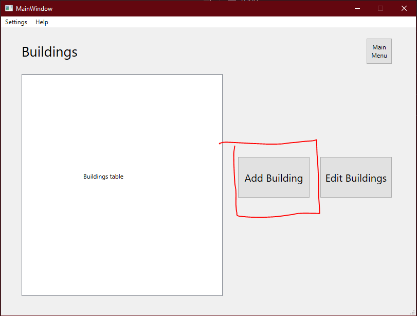
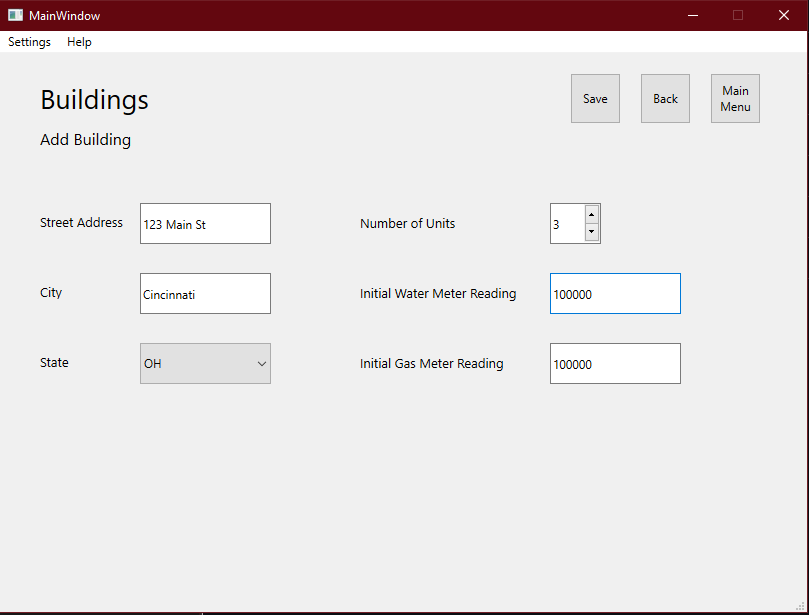

# Adding a Building
## Add a new building to begin tracking tenants and utilities

The most basic element of this application is the "building". Each building houses tenants and has utility meter readings. Add a new building to begin.
- From the main menu, select "Buildings"
- From the "Buildings" menu, select "Add Building"
 
- Enter the necessary information in the next screen and click "Save" to save it to the database.
 