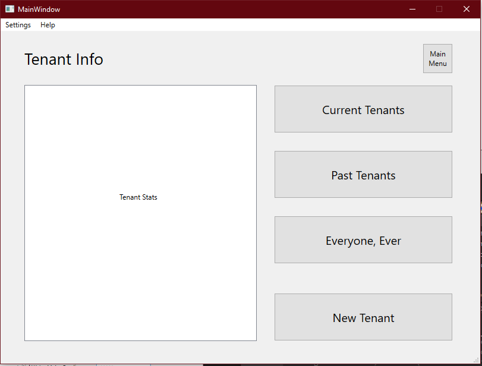
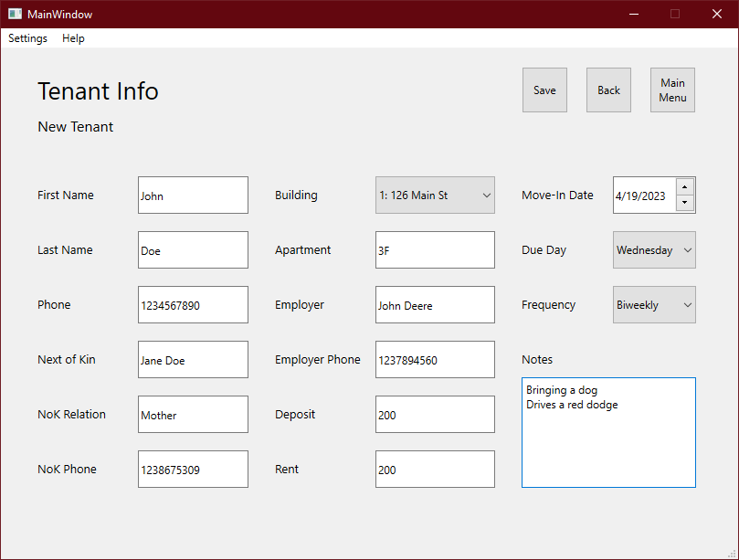

# Adding a Tenant
## Add a new tenant to begin tracking their information and rent payments

Each building houses tenants, each tenant has their personal information on the lease and makes payment every week, month, etc.
- From the main menu, select "Tenants"
- From the "Tenant Info" menu, select "New Tenant"
 
- Enter the necessary information in the next screen and click "Save" to save it to the database.
 