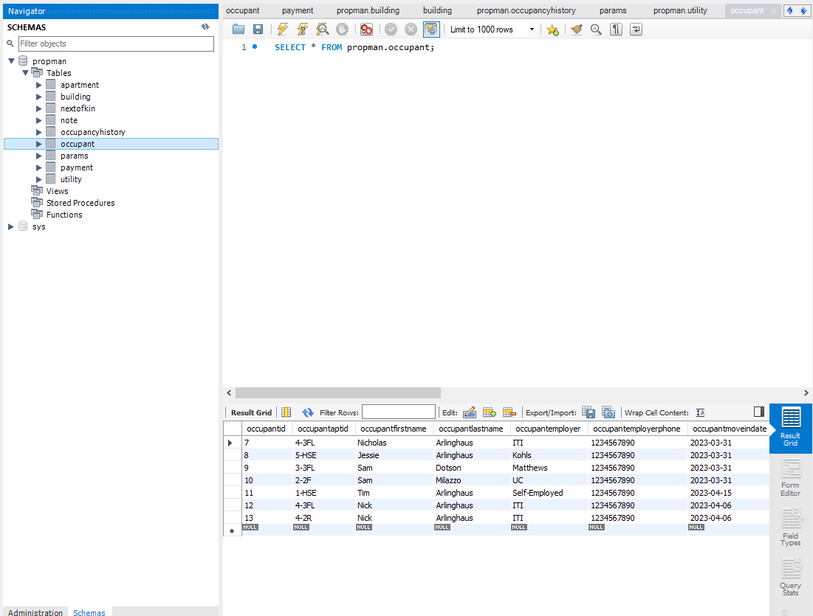

# Database Structure
## The layout of the database for manual views or edits

The database is made up of nine tables:
- apartment: each apartment gets its own entry
  - apartmentid: primary key used to identify each apartment. Usually a number automatically iterated with each new addition.
  - apartmentbuilding: primary key of the building the apartment is in.
  - apartmentfloor: floor of the building an apartment is on. Numeric value.
  - apartmentdir: direction of the apartment within the building (e.g. F (front), R (rear), HSE (house), etc.) String value.
  - apartmentkey: label of key that unlocks apartment. String value.
  - apartmentisactive: boolean value to indicate if apartment is currently occupied.
- building: each building gets its own entry
  - buildingid: primary key used to identify each building. Usually a number automatically iterated with each new addition.
  - buildingstreetnum: street number of the building. String value with max size 6 characters.
  - buildingstreetname: street name of the building. String value.
  - buildingcity: city the building is located in. String value.
  - buildingstate: state the building is located in. String value, 2-letter capitalized USPS state code found [here.](https://about.usps.com/who/profile/history/state-abbreviations.htm)
  - buildingisactive: boolean value to indicate if a building is currently active (belongs to user). Database tracks historical data so buildings are never fully "removed" even after sale.
  - buildingunits: number of units in a building.
- nextofkin: tracks next-of-kin for each tenant
  - nextofkinid: primary key used to identify each next-of-kin. Usually a number automatically iterated with each new addition.
  - nextofkinfirstname: next-of-kin's first name. String value.
  - nextofkinlastname: next-of-kin's last name. String value.
  - nextofkinphone: next-of-kin's contact phone number. String value.
  - nextofkinrelationship: next-of-kin's relationship to tenant. String value.
- note: notes added for each tenant
  - noteid: primary key used to identify each note. Usually a number automatically iterated with each new addition.
  - noteoccupantid: occupant id for tenant associated with note. Numeric value.
  - note: the actual note to save.
- occupancyhistory: history of each occupant in each apartment. Because sometimes tenants move.
  - occupancyhistoryid: primary key used to identify each entry. Usually a number automatically iterated with each new addition.
  - occupancyhistoryoccupantid: primary key of the tenant associated with the historical entry
  - occupancyhistoryaptid: primary key of the apartment associated with the historical entry
  - occupancyhistorymoveindate: date of move-in for this entry. MySQL "datetime" value.
  - occupancyhistorymoveoutdate: date of move-out for this entry. MySQL "datetime" value.
- occupant: individual tenant information
  - occupantid: primary key used to identify each tenant. Usually a number automatically iterated with each new addition.
  - occupantaptid: primary key of the apartment the tenant is living in
  - occupantfirstname: tenant's first name. String value.
  - occupantlastname: tenant's last name. String value.
  - occupantemployer: tenant's current employer. String value.
  - occupantemployerphone: tenant's employer's phone number. String value.
  - occupantmoveindate: tenant's move-in date. MySQL "datetime" value.
  - occupantdeposit: tenant's deposit at move-in. numeric value, decimals allowed.
  - occupantrentamount: tenant's rent amount. numeric value, decimals allowed.
  - occupantdueday: day of the week tenant pays during normal cycle. String value. "(Monthly)" if they pay monthly.
  - occupantpaymentfreq: frequency of payments for tenant. Can be Weekly, Biweekly, or Monthly. String value.
  - occupantnokid: primary key of the next-of-kin associated with the tenant.
  - occupantcell: cell phone of tenant. String value.
  - occupantpaidthru: paid-through date of tenant. MySQL "datetime" value.
  - occupantlastpaid: last time tenant paid. MySQL "datetime" value.
  - occupantbalanceamt: previous balance tenant holds with property owner. Numeric value, decimals allowed.
- params: extra application-specific parameters
  - paramstype: string of variable name for parameter
  - paramsvalue: value of parameter
- payment: for tracking each individual payment by each tenant
  - paymentid: primary key used to identify each payment. Usually a number automatically iterated with each new addition.
  - paymentoccupantid: primary key of the tenant making the payment
  - paymentapartmentid: primary key of the apartment the tenant is paying for
  - paymentamount: amount of money being paid for this payment. Normal numeric value.
  - paymentdate: date of payment. MySQL "datetime" value.
- utility: each utility meter reading
  - utilityid: primary key used to identify each utility meter reading. Usually a number automatically iterated with each new addition.
  - utilitytype: identifier for each utility type being tracked. "1" for water, "2" for gas, "3" for electricity.
  - utilitybuildingid: primary key of the building this reading is from
  - utilitydate: date of the utility meter reading. MySQL "datetime" value.
  - utilityreading: actual reading from the meter. Numeric value, decimals allowed.
 