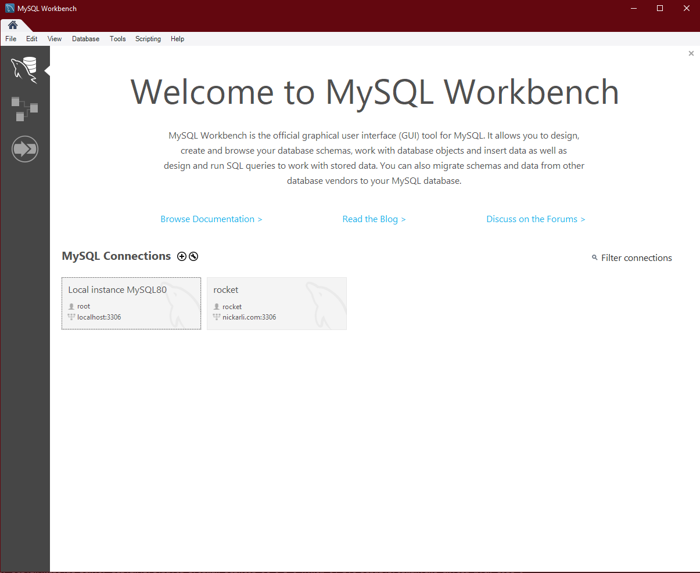
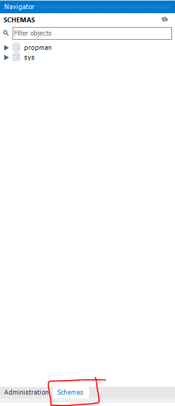
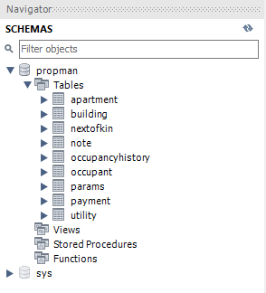
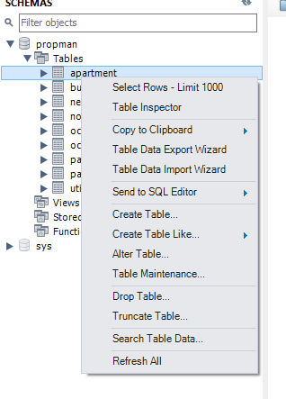
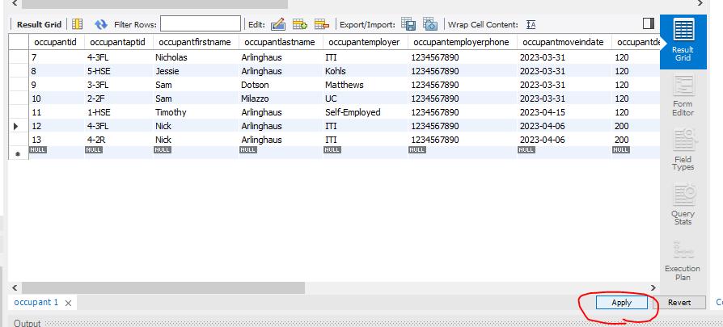
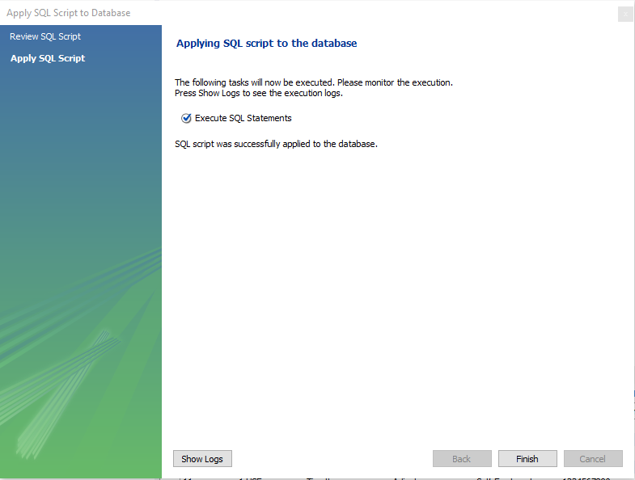

# Viewing the Database
## Viewing the database without the application layer. Assumes MySQL Workbench was installed.

To view the database:
- Open MySQL Workbench and select "Local instance MYSQL80"
 
- On the left-hand sidebar, switch from the "Administration" tab to the "Schemas" tab.
 
- Expand the "propman" database as well as the "Tables" option to view the tables in the database.
 
- To view the contents of a table, right-click it and select "Select Rows - Limit 1000"
 
- To edit a value, double-click the field, change the value, hit the enter key, and select "Apply" at the bottom right. Make sure the data being entered follows the table's rules for that field!
 
...a window will pop up with MySQL syntax to execute. Click "Apply" here as well and it will update the table.
 