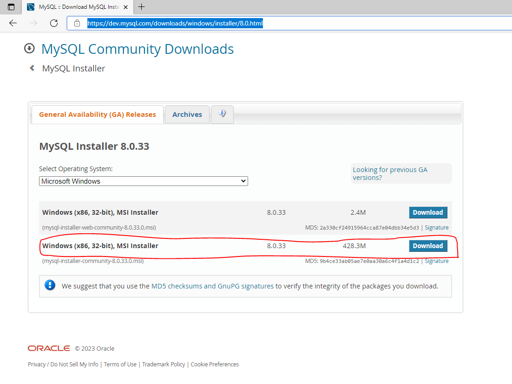
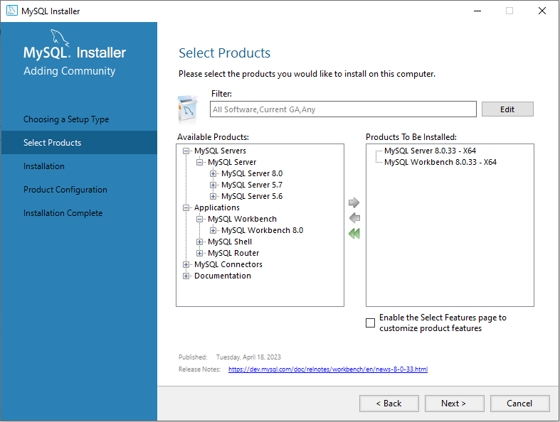
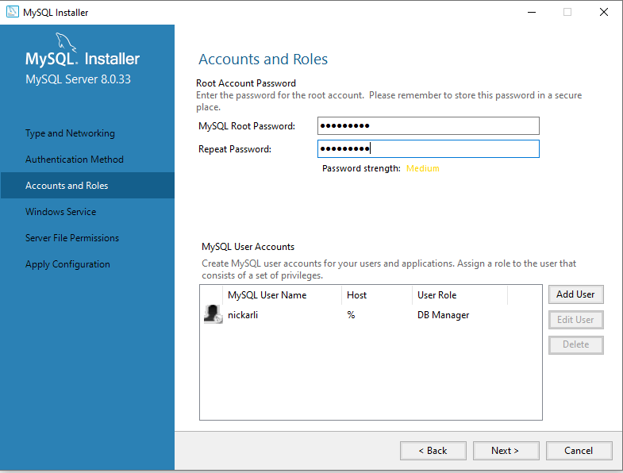
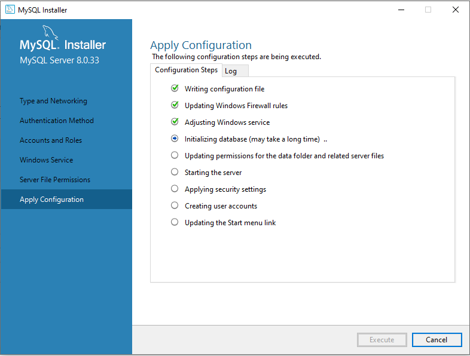
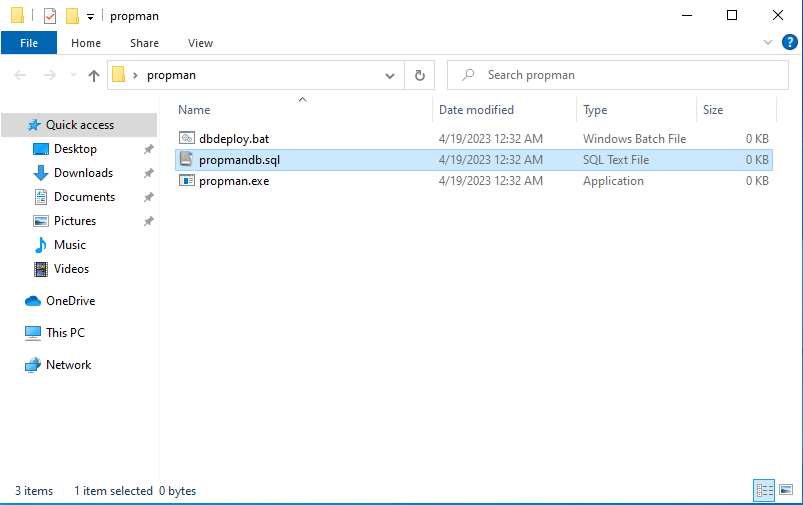
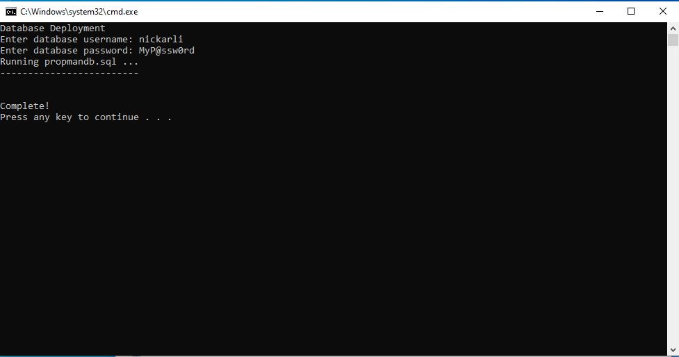

# Database Setup
## Deploying the database on a Windows machine

This application relies on MySQL 8 to store data from the interface. Due to licensing rules, it is not included with this application's installer. 

- Get the MySQL Community edition installer from [here.](https://dev.mysql.com/downloads/windows/installer/8.0.html)
- Select "Microsoft Windows" as the operating system and click "Download" next to the larger installer file (~400MB). 
- Once the download is complete, run the installer.
- After the installer is configured, it will ask you to choose a "Setup Type". Choose "Custom".
- **Required:** Drop down the "MySQL Servers" dropdown until you see "MySQL Server 8.0.xx - X64".
  - Select it, then click the green "right" arrow in the middle to add it to your install queue.
- **Optional:** Close the MySQL Servers dropdown and drop down the "Applications", then "MySQL Workbench" dropdowns until you see "MySQL Workbench 8.0.xx - X64".
  - Select it, then click the green "right" arrow in the middle to add it to your install queue.
  - **Why?** MySQL Workbench offers a GUI interface into the raw data on the database server. This allows for viewing and editing the data directly from the database **if you know what you're doing.** 
- Select "Next" at the bottom of the window.
- Select "Execute" at the bottom of the window to begin installation. This will take about a minute. Select "Next" at the bottom of the window when complete.
- MySQL now wants you to configure your database server. Click "Next" at the bottom of the window.
  - The first screen you see about "Type and Networking" can keep all the default values. Click "Next".
  - The next screen will ask about the Authentication Method. Keep the default value "Use Strong Password Encryption for Authentication (RECOMMENDED)" and click "Next".
  - The next screen will ask for a root account password and other user accounts. 
    - Enter a password to use for the root account. The root account is the database's administrator, and should not be the account used to access the propman database.
    - Under "MySQL User Accounts", click "Add User". 
      - Give your account a username
      - Leave "Host" as the default value
      - Select the user's role as "DB Manager"
      - Enter and confirm a unique password 
      - Click OK (remember these credentials!)
    - Click "Next" 
  - The next screen will ask about Windows Service configurations. Keep everything as default and click "Next".
  - The next screen will ask about Server File Permissions. Keep everything as default and click "Next".
  - The last screen will outline the steps it is going to take once you click "Execute". Click "Execute".
  - Click "Finish" when it is finished. 
- Click "Next", "Finish" to complete installation and configuration. Depending on whether you installed MySQL Workbench, it may open automatically. It is OK to close for now. Also close the MySQL Installer window.
- ## **Now that the database software is installed, we need to deploy the database.**
- Included with the software are three files: propman.exe, dbdeploy.bat, and propmandb.sql. Double-click dbdeploy.bat to deploy the database. 
  - A window will appear asking for the credentials to your custom user you created during MySQL setup. **DO NOT USE THE ROOT ACCOUNT!**
  - Once complete, press any key to close the window.