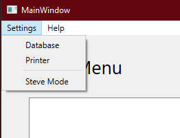
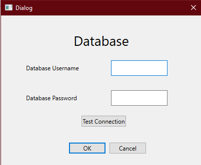

# Application Setup
## Preparing the application for first-time use

The only setup needed by the application before its primary functionality can be accessed is to point to the correct database.
- Open the executable (propman.exe)
- In the menu bar, select "Settings". 
- In the menu that drops, select "Database"
 
- This opens the database connection menu. 
  - Enter your database's username and password. **DO NOT USE THE ROOT USER!**
  - Click "Test Connection" to ensure the credentials are correct. 
  - If they're correct, click "OK" to save.
 
- You've successfully added the database connection and can begin tracking properties.