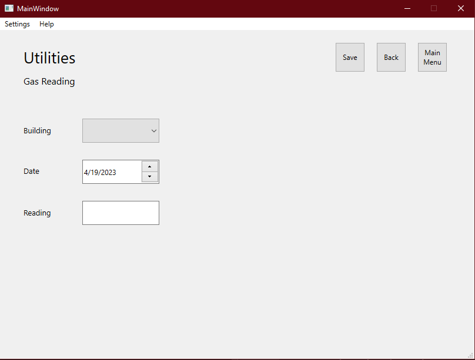

# Add Gas Meter Entry
## Add an entry to the gas meter log for tracking
-  From the Main Menu, select "Utilities"
-  Select "Add Gas Entry"
 
- Select the building, the date recorded (default is today), and enter the reading
- Click "Save" to save the entry