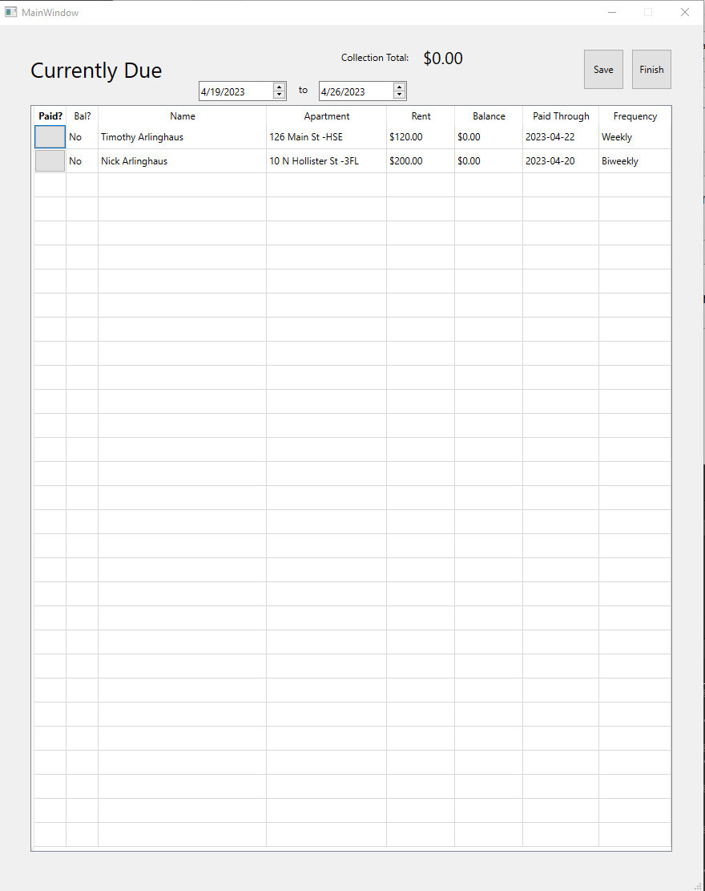

# Mark as Paid
## Marking tenants as paid is a core functionality of the application
- Select "Currently Due" from the Main Menu.
- In the window that appears, you see tenants whose due date falls within the dates specified at the top (default: today to next week). Adjust as needed.
- To mark a tenant as paid for the cycle, select the "Paid?" button in the row next to their name.
  - Tenants without a balance will be automatically added to the queue to save and no further action is needed
  - Tenants with a balance ("Yes" in the "Bal?" column) will require you to enter their payment amount and new paid-through date into a prompt before adding their payment to the save queue.
  - A running balance of money collected for this period appears at the top of the screen.
- Once all payments have been marked, click the "Save" button to apply these payments to the database.
 