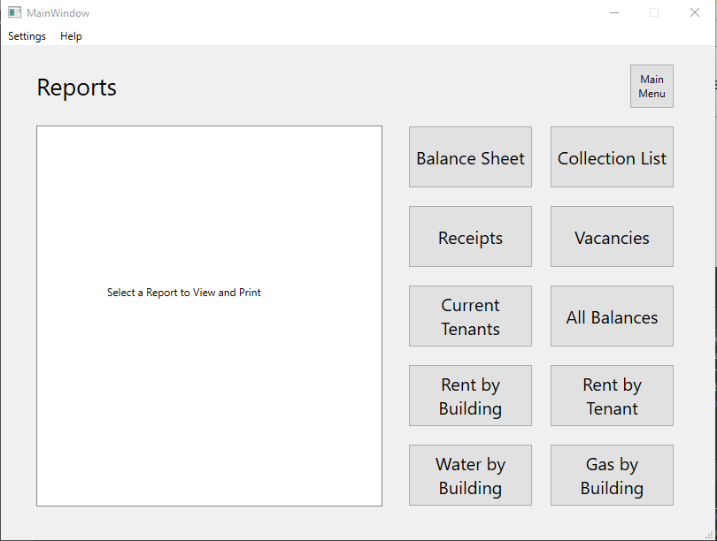

# Printing Reports
## Printing reports for income, utilities, or vacancies over time
- From the Main Menu, select "Reports"
 
- Select the report you wish to print
- If applicable, a dialog will appear asking which dates you'd like the report to generate data for. E.g. Rent by Building, Water by Building are all over time.
  - Others, such as current vacancies, will generate immediately
- A "Preview" screen will appear for your chosen report with options to save as PDF or send to printer.